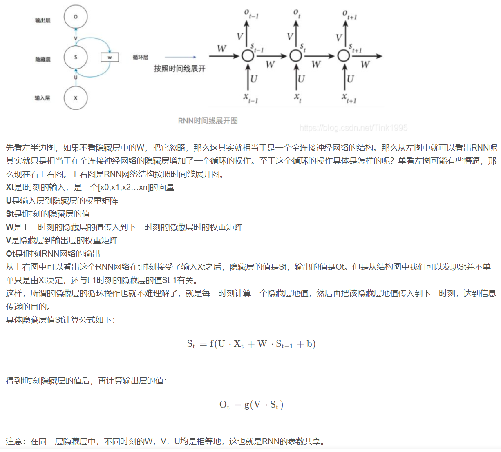
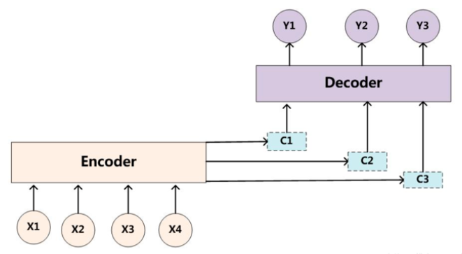
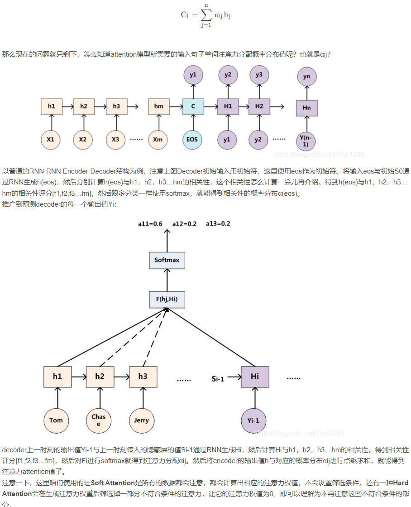
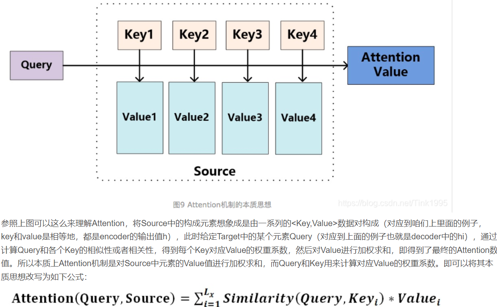
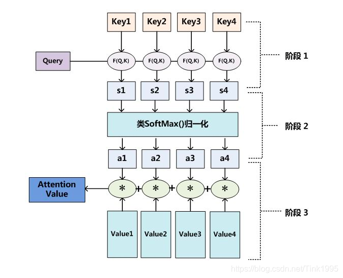
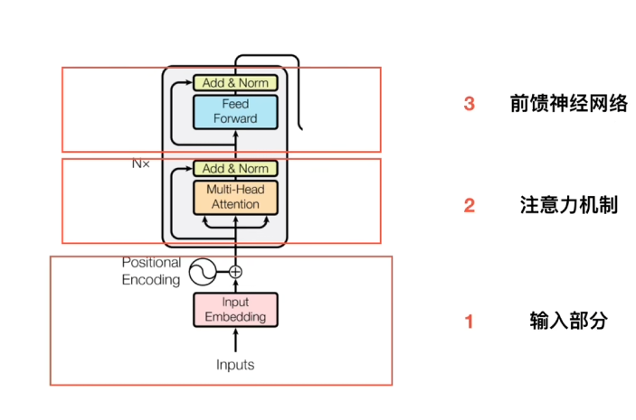
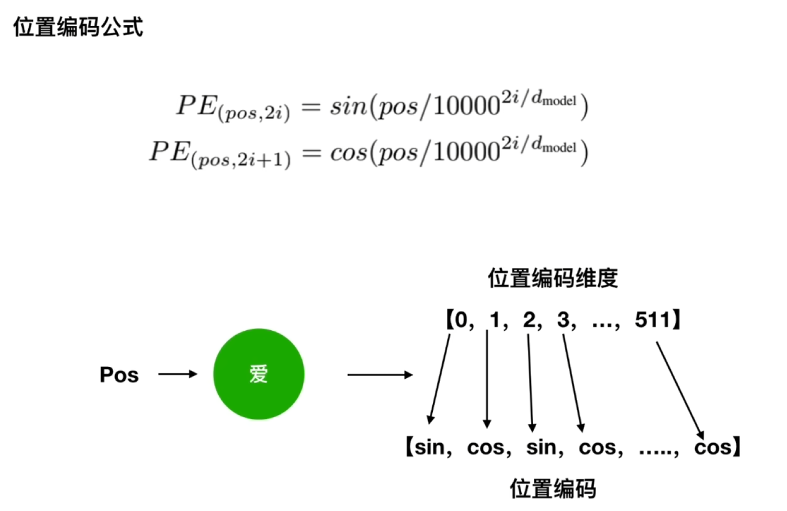

# From《Attention is All You Need》

## 1、详细流程

### **整体结构**
  
#### 说明

* NLP（Natural Language Processing）:自然语言处理
* RNN(Recurrent Netural Network)循环神经网络，隐藏层的前后时刻是有关系的，沿着时序反复迭代。
* 序列信息：一段连续的信息，前后信息是有着关系的，必须将不同时刻的信息放在一起才能理解；
* 全连接神经网络：每一层都是相互独立，每一层中各节点又是相互独立的，前后无关;
  
  **全连接神经网络由于各层级节点相关独立，无法处理序列信息**

输入-》encoder->decoder-》输出；（encoder和decoder各包含6个block）

#### Attention原理

1. **注意力机制**：对于某个事物（文字或者图片）不同的人观察注意到的可能是不同的地方
2. RNN(循环神经网络)：[参考地址](https://blog.csdn.net/Tink1995/article/details/104868903?spm=1001.2014.3001.5502)

  

#### 引入Attention 机制的Encoder-Decoder框架
  
  

  1. 输入注意力分配概率分布值：
     1. 
  2. **（decoder上一时刻的输出值Yi-1与上一时刻传入的隐藏层的值Si-1通过RNN生成Hi，）**
  3. 本质思想：Attention机制是对Source中元素的Value值进行加权求和，而Query（输出）和Key（输入encoder）用来计算对应Value的权重系数；
  
  

  

  1. Self-Attention:source内部或者target内部之间的attention值，可以理解为source与target相同

#### 工作流程

1. 获取单词表示向量**X**,X=单词的Embedding+位置的Embedding;
    * 其中,单词Embedding是从原始数据提取的feature；
2. 将单词的表示向量矩阵传入encoder,得到句子所有单词的编码信息矩阵**C**，**X**(n*d)维，n为单词个数，d是向量维度（论文中是512）；每个encoder block输出矩阵的维度与输入完全一致；
3. 将编码信息矩阵**C**传递到decoder中，decoder依次根据当前翻译过的单词1~i，翻译下一个单词i+1.具体翻译的时候，到第i+1个的时候，需要用**Mask**遮盖住i+1之后的单词；

* 多个encoder和多个decoder结构相同，但是参数不同，都是独立训练的；
* embedding:wordtovec 向量
* 位置编码：
  1. 原因：（RNN）->线性处理
  2. transformer：并行处理,忽略了单词间的位置关系, 具体如下：

  